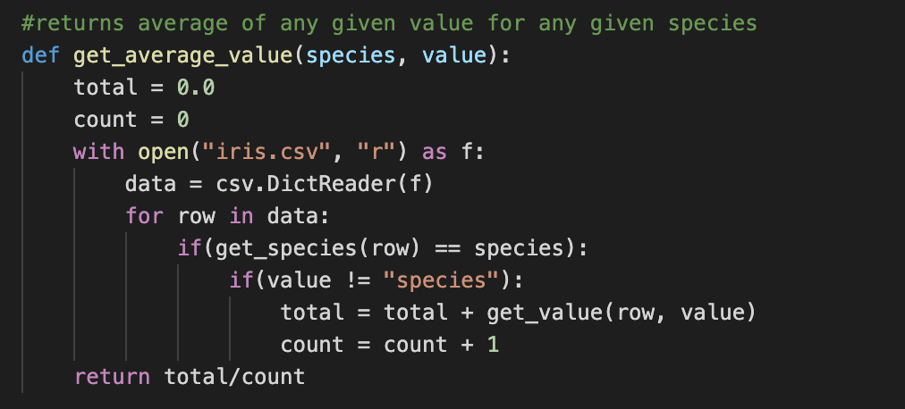

### Lab Summary
In the Iris Lab, I was given the Iris data set, which contained data for 150 different different irises of three different species.
The data given for each iris included the lengths of its sepals and petals, as well as their widths. With this information the lab
asks which _species_ of iris has the longest **average** petals, and which has the widest **average** sepals.

### Methods 

To determine the answers to these questions, I created a universal (for this data set) method that takes an iris species and a value that you want the average of and returns the average of that value for the given species. The method works by using the helper method get_value(row,value) to access the values of any given row. Get_value retrieves the inputed value for the inputed row. For example, get_value(3, "sepal-length") would return the value of the sepal length of the iris in row 3 of the data set. Using this helper method, the get_average_value(species, value) method is able to easily calculate the average of any value for any species by iterating through the entire data set once, checking if each line is an entry for the desired species, and, if so, adding the value of the desired category to the total for that species. Ultimately, after iterating once through the entire data set, the get_average_value method divides the sum of the values obtained by get_value by the amount of times get_value was called, producing the average.

This is what the method looks like:

### Results

After running this method 6 times (1 call to petal length for each species and 1 call to sepal width for each species), the numbers are as follows:

_Average Petal Length:_
* Iris-Setosa: 1.464
* Iris-Versicolor: 4.26
* **Iris-Virginica: 5.552**

_Average Sepal Width:_
* **Iris-Setosa: 3.418**
* Iris-Versicolor: 2.77
* Iris-Virginica: 2.974

Evidently, the iris with the longest average petals was Iris-virginica, and the iris with the widest average sepals was Iris-setosa.